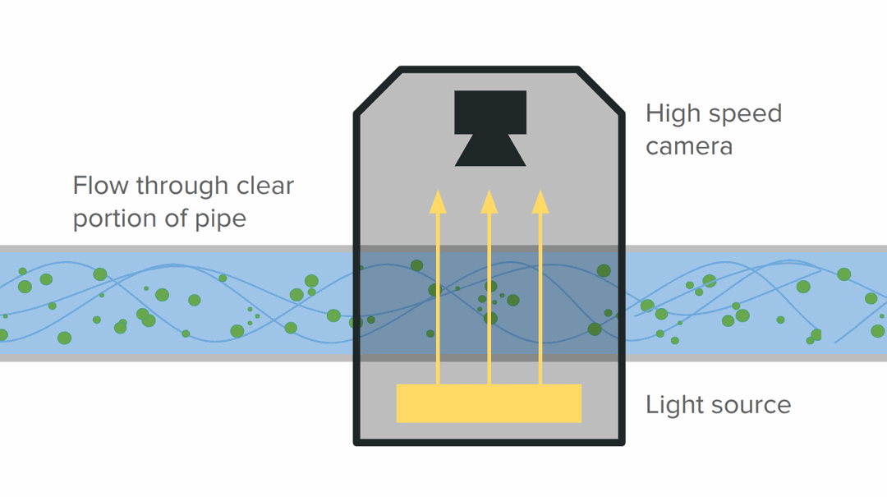
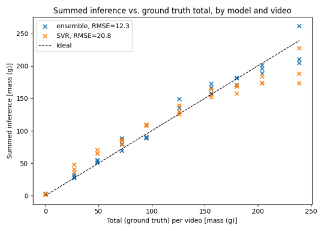

# Mass Estimation from Flow Videos

## Project overview

### Idea

The original idea I was investigating with this repository was an internally lit inspection box, where the mass flow of objects passing through a pipe could be calculated using backlit video. At [my previous job](https://franzericschneider.github.io/pages/fyto.html) we were harvesting waterborne plants by pumping plants and water along a pipe, and it would have been valuable to get a real-time estimate of harvested biomass. Eventually these videos could also support additional analyses, such as assessing plant health, detecting debris or pests, and monitoring water quality. This project tests the hypothesis that a backlit video could be used to estimate biomass flow with reasonable accuracy.



### Data

I took data using videos of plants flowing through a backlit tube at different exposure lengths and plant mass for a fixed volume of water. For example, here was a sample of 156 grams of plant material with an exposure of of 1ms.


### Results

To predict mass from frame images, I tried two main approaches:

1. Classical ML on image statistics
    * Models: Ridge Regression, SVR, Random Forest
    * Features: average, std dev, histogram, and entropy from grayscale, RGB, or HSV channels
2. CNN-based regressors
    * Backbones tested: EfficientNet B0, MobileNet V3 Small, ResNet18, ConvNeXt Tiny

These were trained against per-frame pseudo mass labels. I don't actually know how much mass is visible in a given frame, but I know that over a whole video a certain mass passed by. Frames were then assigned a pseudolabel of `total mass / frames in the video`. The best results came from an ensemble of CNNs. As a sanity check, I compared the integrated per-frame predictions to ground truth total mass per video — the ensemble tracked actual mass flow closely and consistently outperformed the SVR, though both performed reasonably well.



The best ensemble model performed better than best standalone model, having a higher coefficient of determination (R²) and lower error (RMSE, MAE).

| Metric (Test Set) | Best Standalone Model  | Best Ensemble              | Improvement (%) |
|-------------------|------------------------|----------------------------|-----------------|
|                   | EfficientNet           | EfficientNet / MobileNet   |                 |
| R²                | 0.906                  | 0.916                      | +1.1%           |
| RMSE (g/frame)    | 0.173                  | 0.164                      | -5.2%           |
| MAE (g/frame)     | 0.123                  | 0.115                      | -6.5%           |

Here's an example visualization of inference from the EfficientNet / MobileNet ensemble model on a video (204g of plant material, 1 ms exposure).


### Summary

In summary, this project estimates biomass from videos of flowing plant material using supervised machine learning. I compared classical ML regressors to fine-tuned CNN-based models (ConvNeXt, ResNet, MobileNet, EfficientNet) for predicting mass flow. The pipeline includes frame extraction, data augmentation with Albumentations, and experiment tracking and hyperparameter tuning with Weights & Biases (wandb). Ensemble models were also tested, and outperformed individual models in most cases.

See [more details on the process here](https://docs.google.com/presentation/d/1c1pRzYdqQnm1N_qd-dYQaPG8VoMrDPT5KWU83HVyGdI/edit?slide=id.p#slide=id.p).


## Using the repository

### Data capture using a LUCID Vision camera

```
cd capture/
```

#### How to build Docker

```
docker build --build-arg UID=$(id -u) --build-arg GID=$(id -g) -t flow .
```

#### How to run Docker

```
mkdir /tmp/images/
docker run -it --rm --net host -u $(id -u):$(id -g) --volume /tmp/images/:/tmp/images/ flow -e <exposure>
```

Here is an example usecase that can be used for repeated data gathering

```
export EXP=6000
export DIR=e_"$EXP"/l_95_3/
mkdir -p ~/Pictures/flowdata/$DIR; docker run -it --rm --net host -u $(id -u):$(id -g) --volume ~/Pictures/flowdata/$DIR:/tmp/images/ flow --exposure $EXP --number-frames 100
```

#### Installing the Arena SDK

I captured video using the [LUCID Vision TRI122S-CC](https://www.edmundoptics.com/p/lucid-vision-labs-tritontrade-tri122s-cc-sony-imx226-122mp-color-camera/41825/) in Linux. I needed to install the Arena SDK in order to capture images with this camera, which required some modifications to their documented process.

* Follow the Arena SDK for Linux steps here: https://support.thinklucid.com/arena-sdk-documentation/
    * In order to "update ethernet drivers" I ran `sudo apt update; sudo apt full-upgrade`
    * Ignoring the Jumbo Frames steps, MTU of 9000 is over my hardware limit
    * Couldn’t run ethtool step "netlink error"
    * Had to modify the rmem steps
        * `sudo sh -c "echo 'net.core.rmem_default=134217728' >> /etc/sysctl.conf"`
        * `sudo sh -c "echo 'net.core.rmem_max=134217728' >> /etc/sysctl.conf"`
        * `sudo sysctl -p`
* Download and unpack the SDK: https://thinklucid.com/downloads-hub/
    * Arena SDK – x64 Ubuntu 22.04/24.04
    * `cp ~/Downloads/ArenaSDK_v0.1.95_Linux_x64.tar.gz path/to/flow_videos/Arena/`
    * `tar -xzvf ArenaSDK...tar.gz; rm ArenaSDK...tar.gz`
        * Instructions are found in `Arena/README`
        * You can confirm with `g++ -v` that the version >5, and `make -v` should be installed
* Download and unpack the Arena Python Package: https://thinklucid.com/downloads-hub/
    * `cp ~/Downloads/arena_api-2.7.1-py3-none-any.zip path/to/flow_videos/Arena/python/`
    * `unzip arena_api...zip; rm arena_api...zip`

### Data analysis

#### Data preparation

The first step is to take the video data (series of images) and turn them into clipped and processed windows, with stats calculated for each window. We want to calculate the stats once, then we can try to fit various stats against our state of interest in the training step. Example run of the preparation tool:

```
~/flow_videos$ python3 -m  assess.prepare.snip --data-dir path/to/capture/ --start-stop range.json --lookup-dict state.json --windows windows.json --save-dir /tmp/ --downsample 20
```

The output will take the form
```
/tmp/
    data_<timestamp>/
        train/
            clipped image windows of the desired resolution
        test/
            clipped image windows of the desired resolution
        metadata.json
            {
                "kwargs": kwargs,
                "name": amalgamate trial name,
                {
                    path/to/image: {stats, origin image, origin window}
                    ...
                }
            }
```

#### Classical model training

The next step is to train various basic regressors against the image stats calculated in data preparation. The models will be saved and can be assessed later. Example run of the training tool:

```
~/flow_videos$ python3 -m assess.train_classic.train --data-dir path/to/data_<timestamp>/ --save-dir /tmp/ --stat <chosen stat> --state-key <state key> --model <model>
```

An example of a loop over various settings:

```
~/flow_videos$ for directory in path/to/data_*/; do
    for stat in gray-average hsv-average rgb-average; do
        for model in SVR ridge forest; do
            for flag in "--scale" ""; do
                python3 -m assess.train_classic.train --save-dir /tmp/ --state-key <state key> --data-dir "$directory" --stat "$stat" --model "$model" $flag
            done
        done
    done
done
```

The output will take the form
```
/tmp/
    data_<input timestamp>_<created timestamp>/
        model.joblib
        metadata.json
            {
                "kwargs": kwargs,
                "name": amalgamate trial name,
                "R2_*", "RMSE_*", "MAE_*": training stats for model
                "X_*", "y_*", "y_pred_*": raw data, labels, and predictions
            }
```

#### CNN model training

The next step is to train various CNN based regressors against the snipped image windows. The models will be saved and can be assessed later. Example run of the training tool:

```
~/flow_videos$ python3 -m assess.train_cnn.train --data-dir path/to/data_<timestamp>/ --save-dir /tmp/ --state-key <state key> --model mobilenet_v3_small --batch-size 32 --num-epochs 20 --learning-rate 0.001
```

The output will take the form

```
/tmp/
    data_<input timestamp>_<created timestamp>/
        best_model.pt
        metadata.json
            {
                "kwargs": kwargs,
                "name": amalgamate trial name,
                "R2_*", "RMSE_*", "MAE_*": training stats for model
                "y_*", "y_pred_*": labels and predictions
            }
```

#### Ensembles

In order to evaluate ensembles of CNN-based models, run the following:

```
~/flow_videos$ python3 -m assess.train_cnn.evaluate path/to/data_<timestamp>/ /tmp/ensemble/ --model-dirs path/to/trained/model1/ path/to/trained/model2/ --name <human readable name>
```

The ensembled model will not be saved, but in the save directory a `metadata.json` file with the same format as **CNN model training** will be produced. The assessment tools will work on the ensemble output just like they will the output of single models.

#### Assessment

This tool can be used to sort all models by a chosen stat (e.g. R², MAE, RMSE) and/or scatter the model results with a given kwarg on the X axis to compare performance across the options of the kwarg (see `--help` for instructions).

```
~/flow_videos$ python3 -m assess.assess.compare --data-dir path/to/train/data/ --stats <stat> --plot-ranking --plot-vs-variable meta.kwargs.stat
```

This tool will display the results of a single model on a single video. Note that `--trial` and `--vid` will depend on how you recorded your initial videos. I recorded them in the format:

```
exposure_1ms/
    vid1/
    vid2/
    ...
exposure_3ms/
    vid1/
    vid2/
    ...
```

And so I ran the tool with `--trial exposure_3ms --vid vid1`

```
~/flow_videos$ python3 -m assess.assess.inspect --data-dir path/to/train/data/ --save-dir /tmp/inspect/ --trial <trial> --vid <vid> --state-key <state key> [--animate]
```

This tool will display the results integrated across each video, comparing multiple models.

```
python3 -m assess.assess.inspect_totals --result-dirs path/to/trained/model1/ path/to/trained/model2/ --names name1 name2 --save-dir /tmp/inspect/ --state-key <state key>
```
